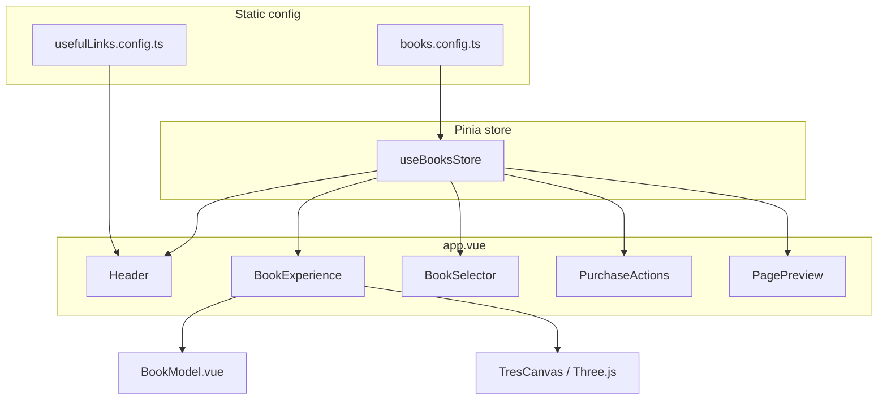
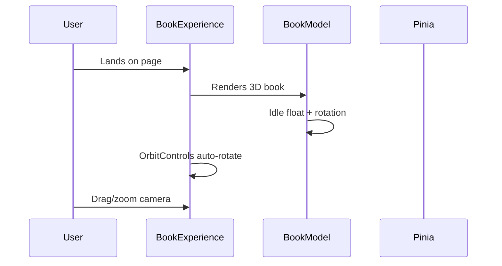

# Vinciane Livres — Codebase Documentation & Walkthrough

This is an **immersive 3D book showcase** for author **Vinciane Hodiamont**. Visitors browse a small catalog of books in a WebGL scene, open them to read sample pages, and follow outbound links to buy on Amazon, Fnac, Apple Books, etc.

It is **not** a full e-commerce app: there is no cart, checkout, backend API, or payment integration. All book data is static TypeScript config, and the app runs entirely in the browser as a **client-only SPA**.

---

## High-level architecture



**Layering (z-index):**

| Layer | Component | z-index | Role |
|-------|-----------|---------|------|
| Background | `BookExperience` | 10 | Full-screen 3D canvas |
| Click overlay | Inside `BookExperience` | 20 | "Click to explore" |
| Sidebar / panels | `BookSelector`, `PurchaseActions` | 30 | Book list, buy links |
| Page reader | `PagePreview` | 30 | Full-screen overlay when open |
| Navigation | `Header` | 50 | Top nav, modals |
| Modals | `ModalPortal` | 60 | About / Contact |

---

## Tech stack

| Layer | Choice | Notes |
|-------|--------|-------|
| Framework | **Nuxt 4** (`^4.4.8`) | Nuxt 4 `app/` directory layout |
| UI | **Vue 3** (`^3.5.38`) | Composition API, `<script setup>` |
| State | **Pinia** + `@pinia/nuxt` | Single `books` store |
| 3D | **TresJS** + **Three.js** | Declarative Three.js in Vue |
| Animation | **GSAP** (`^3.15.0`) | 3D transitions, modals, dropdowns |
| Styling | **Tailwind CSS** | Custom dark/gold design tokens |
| Rendering | **SPA only** (`ssr: false`) | No server-side rendering |
| i18n / auth / API | None | Static data only |

**Unused dependency:** `lottie-web` is in `package.json` but not referenced anywhere in `app/`.

---

## Project structure

```
nuxt-app/
├── app/
│   ├── app.vue                 # Root shell — composes all UI
│   ├── components/             # 7 Vue components
│   ├── composables/
│   │   └── useThreeScene.ts    # GSAP timeline lifecycle helper
│   ├── config/
│   │   ├── books.config.ts     # Book catalog (static data)
│   │   └── usefulLinks.config.ts
│   └── stores/
│       └── books.ts            # Central Pinia store
├── public/
│   └── robots.txt
├── nuxt.config.ts
├── tailwind.config.ts
├── tsconfig.json
└── package.json
```

**Intentionally absent:**

- `app/pages/` — no file-based routing; everything lives on `/`
- `server/` — no Nitro API routes
- `middleware/`, `plugins/`, `layouts/`
- `.env` / `runtimeConfig` — no secrets or env-driven config
- CI/CD configs (`.github/`, Dockerfile, etc.)

---

## Getting started

```bash
cd nuxt-app
npm install
npm run dev      # http://localhost:3000
npm run build    # production SPA build → .output/
npm run generate # static site generation
npm run preview  # preview production build
```

No environment variables are required today.

---

## Configuration

### Nuxt (`nuxt.config.ts`)

```typescript
export default defineNuxtConfig({
  compatibilityDate: '2025-07-15',
  devtools: { enabled: true },
  modules: [
    '@nuxtjs/tailwindcss',
    '@pinia/nuxt',
    '@tresjs/nuxt'
  ],
  build: {
    transpile: ['gsap']
  },
  app: {
    head: {
      title: 'Vinciane — Immersive Book Experience',
      // ... meta, Google Fonts (Inter + Playfair Display)
    }
  },
  ssr: false
})
```

Key decisions:

- **`ssr: false`** — entire experience is client-rendered; good for WebGL-heavy apps
- **`transpile: ['gsap']`** — ensures GSAP bundles correctly
- **Modules** — Tailwind, Pinia, TresJS auto-configured

### Tailwind design tokens (`tailwind.config.ts`)

- **Fonts:** Inter (sans), Playfair Display (serif)
- **Colors:** `surface-*` (zinc-like dark scale), `accent` (gold `#c9a96e`)
- **Animations:** `float`, `pulse-slow`, `fade-in`
- **Primary background:** `#09090b` (`surface-950`)

---

## Application entry point

`app.vue` is the entire UI — no `<NuxtPage />`, no layouts:

```vue
<template>
  <div class="h-screen w-screen overflow-hidden bg-surface-950 text-white font-sans">
    <Header />
    <BookExperience />
    <BookSelector />
    <PurchaseActions />
    <PagePreview />
  </div>
</template>
```

Global styles lock the viewport to full-screen with a dark background and custom scrollbars for any internal scroll areas.

---

## State management — the heart of the app

Everything flows through **`useBooksStore`** in `app/stores/books.ts`.

### State

| Field | Type | Purpose |
|-------|------|---------|
| `books` | `Book[]` | Loaded from `books.config.ts` |
| `activeBookId` | `string` | Currently selected book |
| `isBookOpen` | `boolean` | 3D cover open + page reader visible |
| `isTransitioning` | `boolean` | Book swap animation in progress |
| `currentPage` | `number` | Page index in the reader |

### Getters

- `activeBook` — resolved book object
- `activeBookIndex` — index in the array
- `totalPages` — page count for active book

### Actions & coordination

```typescript
setActiveBook(id: string) {
  if (id !== this.activeBookId && !this.isTransitioning) {
    this.isTransitioning = true
    this.isBookOpen = false
    this.currentPage = 0
    this.activeBookId = id
    // Transition flag cleared by the 3D scene after animation completes
  }
},
openBook() { ... },
closeBook() { ... },
nextPage() { ... },
prevPage() { ... },
finishTransition() {
  this.isTransitioning = false
}
```

**Important pattern:** `setActiveBook` sets `isTransitioning = true`, but **`BookModel.vue`** calls `finishTransition()` when its GSAP swap animation completes. During transitions, `BookSelector` disables clicks and the "Click to explore" overlay is hidden.

---

## Data layer

All content is static TypeScript — no `fetch`, no CMS, no Medusa/Stripe.

### Book schema (`books.config.ts`)

```typescript
interface Book {
  id: string
  title: string
  author: string
  description: string
  coverColor: string    // 3D front/back cover
  spineColor: string      // 3D spine
  pages: BookPage[]       // sample reader content
  stores: StoreLink[]     // external buy links
}
```

Three sample books are defined: *The Digital Odyssey*, *Neon Shadows*, *Minimalist Futures*.

### Useful links (`usefulLinks.config.ts`)

Static outbound links (Goodreads, Press Kit, Literary Agency) used in the header dropdown.

---

## User flows

### Flow 1: Browse the shelf



The 3D book gently floats. Orbit controls allow zoom (4–12 units) and limited polar angle. Auto-rotate stops when the book is open.

### Flow 2: Switch books

1. User clicks a title in **`BookSelector`** (left sidebar)
2. Store calls `setActiveBook(id)` → `isTransitioning = true`, book closes
3. **`BookModel`** watches `activeBookId` and runs a GSAP timeline:
   - Drop + spin + shrink
   - Swap cover/spine colors at midpoint
   - Rise back with elastic scale
4. On complete → `finishTransition()` → idle animation restarts
5. **`PurchaseActions`** updates title/description/store buttons

### Flow 3: Open and read

1. User clicks the canvas overlay ("Click to explore")
2. Store → `openBook()`
3. **`BookModel`** animates cover open (~75° rotation)
4. **`PagePreview`** fades in as full-screen overlay
5. User navigates pages; "Back to shelf" calls `closeBook()`

### Flow 4: Purchase

- **`PurchaseActions`** (bottom-right, when book closed) shows store buttons
- **`Header`** "BUY" dropdown shows stores for the **active** book
- All links open in a new tab — no in-app checkout

### Flow 5: About / Contact

- Header opens **`ModalPortal`** modals
- Contact form is **UI only** (`@submit.prevent`, no handler, no API)

---

## Component walkthrough

### `BookExperience.vue` — 3D scene host

Responsibilities:

- `TresCanvas` with perspective camera at `[0, 0.5, 7]`
- `OrbitControls` from `@tresjs/cientos`
- Three-light setup: ambient, two directional, one point
- Reflective ground plane
- Click overlay to open book (hidden when open or transitioning)

### `BookModel.vue` — procedural 3D book

The book is **built from box geometry**, not a loaded GLB model:

| Part | Geometry | Notes |
|------|----------|-------|
| Spine | Box | Left edge, `spineColor` |
| Front cover | Box + gold title plane | Hinged group for open animation |
| Back cover | Box | Fixed |
| Pages | Box | Off-white `#f5f0e6` |

Dimensions are constants: width 2.4, height 3.2, depth 0.4.

**Animations (GSAP via `useThreeScene`):**

- **Idle:** gentle Y float + subtle Y rotation
- **Open/close:** cover rotates on Y axis; idle pauses while open
- **Book swap:** drop → spin → color swap → rise

### `BookSelector.vue` — left sidebar

Minimal list with numbered indices (01, 02, 03), line indicators, and titles. Disabled during `isTransitioning`.

### `PurchaseActions.vue` — buy panel

Fixed bottom-right. Shows "Now viewing", title, description, and pill-shaped store buttons. GSAP slide-in/out when book opens/closes.

### `PagePreview.vue` — in-app reader

Two-page spread on desktop; on mobile, a **single-page swipe simulation** via `mobileShowRightPage`:

- Page 0 left side = title page (book title + author)
- Right side = current page content
- Mobile "Next/Prev" toggles between left/right halves before advancing `currentPage`
- Page dots jump directly to a page

### `Header.vue` — navigation

- Brand: "Vinciane Hodiamont"
- Desktop: Home, About, BUY dropdown, USEFUL LINKS dropdown, Contact
- Mobile: hamburger with equivalent links
- GSAP dropdown animations; click-outside closes dropdowns
- BUY links are reactive to `booksStore.activeBook.stores`

### `ModalPortal.vue` — reusable modal

- `<Teleport to="body">`
- Props: `isOpen`, `title`; emits `close`
- Escape key + backdrop click to close
- GSAP enter/leave animations

---

## Composable: `useThreeScene`

The only custom composable. Tracks GSAP timelines and kills them on unmount to prevent memory leaks when 3D components are destroyed:

```typescript
export const useThreeScene = () => {
  const timelines = ref<gsap.core.Timeline[]>([])

  const createTimeline = (options?: gsap.TimelineVars): gsap.core.Timeline => {
    const tl = gsap.timeline(options)
    timelines.value.push(tl)
    return tl
  }

  const killAllTimelines = () => {
    timelines.value.forEach(tl => tl.kill())
    timelines.value = []
  }

  onBeforeUnmount(() => {
    killAllTimelines()
  })

  return { createTimeline, killAllTimelines }
}
```

Used primarily by `BookModel.vue` during book swaps (`killAllTimelines()` before starting a new swap).

---

## Styling & design language

**Aesthetic:** dark premium — near-black background, gold accents, glassmorphism panels (`backdrop-blur-xl`, `border-white/10`, semi-transparent backgrounds).

**Typography:**

- Headings: `font-serif` (Playfair Display)
- Body/UI: `font-sans` (Inter)
- Page reader content: serif on cream `#f8f4ed` background

**Animation split:**

- **Tailwind** — layout, hover states, utility animations (`animate-pulse-slow`)
- **GSAP** — anything that needs orchestrated timelines (modals, 3D, dropdowns, page reader)

No dark/light theme toggle.

---

## Developer cookbook

### Add a new book

Edit `app/config/books.config.ts`:

```typescript
{
  id: 'book-4',
  title: 'Your New Book',
  author: 'Vinciane',
  description: '...',
  coverColor: '#1a1a2e',
  spineColor: '#16213e',
  pages: [
    { title: 'Chapter 1', content: '...' },
    { content: 'More text...' }
  ],
  stores: [
    { name: 'Amazon', url: 'https://...' }
  ]
}
```

No other files need changes — the store, selector, 3D model, and purchase panel all read from this config.

### Change store / external links

- Per-book stores → `books.config.ts` → `stores[]`
- Global links (Goodreads, etc.) → `usefulLinks.config.ts`

### Adjust 3D book appearance

- Colors → `coverColor` / `spineColor` in config
- Size/proportions → constants at top of `BookModel.vue` (`bookWidth`, `bookHeight`, etc.)
- Lighting/camera → `BookExperience.vue`

### Wire up the contact form

Currently in `Header.vue`, the form uses `@submit.prevent` with no handler. You would need to: add `v-model` bindings, implement a submit handler, and either add a Nitro server route (`server/api/contact.post.ts`) or call an external service (Formspree, Resend, etc.).

### Add routing / multiple pages

Create `app/pages/` and add `<NuxtPage />` to a layout or `app.vue`. Today the app is deliberately single-view.

---

## Deployment notes

| Command | Output | Hosting |
|---------|--------|---------|
| `npm run build` | `.output/` SPA bundle | Any static host or Node |
| `npm run generate` | Pre-rendered static files | Netlify, Vercel, GitHub Pages |

Because `ssr: false`, SEO depends on the static `<head>` meta in `nuxt.config.ts`. `public/robots.txt` allows all crawlers.

No CI pipeline exists yet.

---

## What is not implemented

| Feature | Status |
|---------|--------|
| E-commerce (cart, checkout) | Not built — link-out only |
| Medusa / Stripe | Not integrated |
| Contact form backend | UI placeholder |
| i18n | English only, hardcoded strings |
| Real book cover textures | Procedural colored boxes + gold title plane |
| GLB 3D model | Not used (book is procedural geometry) |
| Analytics | None |
| Tests | None |
| `.env.example` | Missing |

---

## Mental model for new contributors

1. **Config drives content** — start in `books.config.ts`
2. **Pinia drives behavior** — open/close, page turns, active book
3. **BookModel reacts to store** — watches `isBookOpen` and `activeBookId`
4. **UI layers are independent components** — all subscribe to the same store
5. **GSAP is the motion layer** — modals, dropdowns, 3D, page reader transitions
6. **No backend today** — anything requiring persistence or payments needs new infrastructure

---

## Complete source file map

| File | Responsibility |
|------|----------------|
| `app/app.vue` | Root composition + global styles |
| `app/stores/books.ts` | Central state |
| `app/config/books.config.ts` | Book catalog data |
| `app/config/usefulLinks.config.ts` | Header external links |
| `app/composables/useThreeScene.ts` | GSAP timeline cleanup |
| `app/components/BookExperience.vue` | Three.js canvas + scene |
| `app/components/BookModel.vue` | Procedural 3D book + animations |
| `app/components/BookSelector.vue` | Book list sidebar |
| `app/components/PurchaseActions.vue` | Buy links panel |
| `app/components/PagePreview.vue` | Sample page reader |
| `app/components/Header.vue` | Nav, dropdowns, modals |
| `app/components/ModalPortal.vue` | Reusable modal shell |
| `nuxt.config.ts` | Framework config |
| `tailwind.config.ts` | Design tokens |
